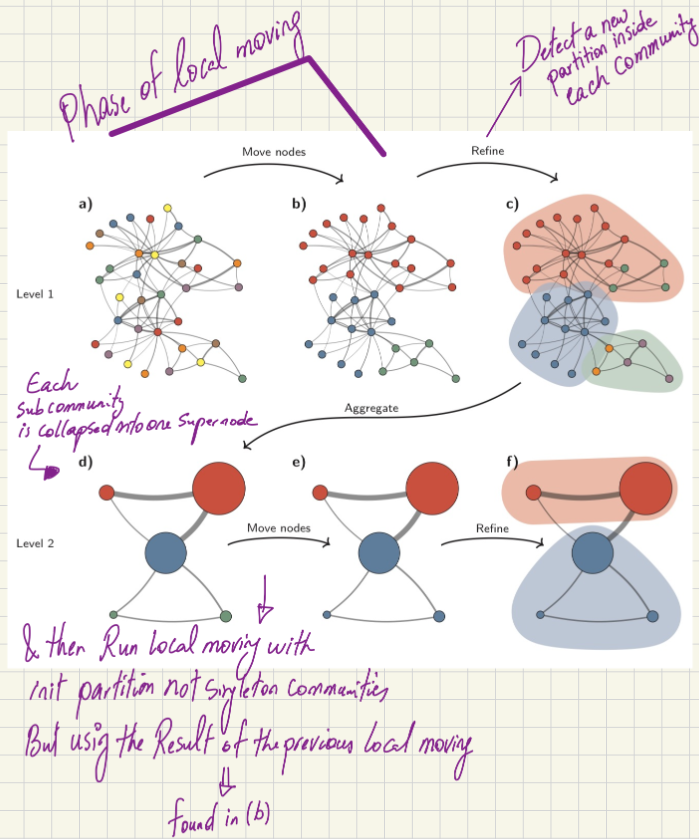

# Understanding the Leiden Clustering Algorithm

## Introduction

Hello! Recently I came across a usecase where I needed a community detection algorithm so I thought about reviewing the **Leiden clustering algorithm** (used for community detection). This algorithm is compatible with large datasets, and is fast.

I strongly recommend to read the original paper, from which my blog post is taken.
We can find it here: https://arxiv.org/pdf/1810.08473
From Louvain to Leiden: guaranteeing well-connected communities by V.A. Traag, L. Waltman, and N.J. van Eck.

So to begin, a "community" refers to a relatively dense group of nodes that are highly connected to each other compared to the rest of the network.

Introduced by Traag et al. from Leiden University in the Netherlands (which gives the algorithm its name), it is generally faster and produces better communities than the classical Louvain clustering algorithm. Actually the Leiden algorithm can be considered as an extension of the Louvain algorithm.

At its core, community detection is an optimization problem. The goal is to optimize a score function, typically **Modularity** or the **Constant Potts Model (CPM)**. Modularity tries to maximize the difference between the actual number of edges inside a community and the expected number of such edges. By adjusting a **resolution parameter**, we can control the granularity of the clustering (i.e., whether the algorithm finds more, smaller communities or fewer, larger ones).

The Modularity score function $H$ can be defined as:
$$H = \frac{1}{2m} \sum_c \left( e_c - \gamma \frac{K_c^2}{2m} \right)$$

* $e_c$: Actual number of edges in community $c$
* $K_c$: Sum of degrees of all nodes in community $c$
* $2m$: Total number of edges in the network
* $\gamma$: Resolution parameter

Optimizing $H$ is an NP-Hard problem. For a long time, the most popular algorithm to optimize this was my predecessor, the **Louvain algorithm**.

Because optimizing the modularity score is an NP-Hard problem, heuristic algorithms are required. For a long time, the most popular algorithm for this was the Louvain algorithm.

---

## The Predecessor: The Louvain Algorithm
To understand Leiden, we first need to understand Louvain and its limitations. The Louvain algorithm operates in two main phases:

1. **Local Moving:**
   * It starts by placing every node in its own isolated community.
   * It then moves through the network, evaluating the impact of moving each node into a neighboring community.
   * If moving a node improves the modularity score, the algorithm makes the move. This continues until there is no further improvement in the score.

   This is the greedy part, where we always try to merge the nodes that increase the score function the most.
2. **Aggregation:** Each detected community is collapsed to become a single "supernode" in a new aggregate network.
3. **Repeat:** Phase 1 is repeated on the aggregated network until the score can no longer be optimized.

### Flaws of the Louvain Algorithm
While fast and popular, Louvain was proven to occasionally lead to arbitrarily badly connected communities. In some severe cases, the communities detected by Louvain could even be **internally disconnected**. 

---

## The Solution: The Leiden Algorithm
The Leiden algorithm fixes the flaws of Louvain by introducing an intermediate step. It consists of three phases:

### Phase 1: Local Moving
This phase works similarly to the Louvain algorithm. It moves nodes to neighboring communities to greedily maximize the score.

### Phase 2: Refinement (Fixing Louvain's Flaw)
This is the step that makes Leiden distinct. Instead of immediately aggregating the communities found in Phase 1, Leiden refines them.
* Within each community detected in Phase 1, the algorithm detects a new partition (a new division of the nodes) by dividing the community back into **singleton communities** (each node on its own).
* It performs a local moving phase similar to Phase 1, but strictly isolated to the scope of each community, and with the following constraints:
  * **The Border Constraint:** The algorithm evaluates a node's local structure. If a selected node is well connected to a neighboring node *within that exact same border* (the boundary of the community detected in Phase 1), it merges them. Any node outside this community boundary is ignored.
  * **Randomness & Positive Impact:** Unlike Phase 1 (which greedily looks for the merge with the *maximum* positive impact on the score), Phase 2 looks for *any* positive increase. If a node has three valid neighbors that would result in score increases of +2, +5, and +1, pure logic would dictate picking +5. However, Leiden randomly picks a node from these three options (likely weighted by the score). This means the +2 merge still has a chance to be picked.
* Randomly evaluating and merging nodes that yield any positive impact prevents the algorithm from getting stuck in a **"local maximum."**

### Phase 3: Aggregation
* Each *refined* subcommunity is collapsed into one supernode.
* Edge weights are calculated by aggregating the local links.
* The algorithm then loops back to Phase 1 to run the local moving process on these newly weighted nodes.
* **Important Note:** When returning to Phase 1 to run local moves, the initial partition will not be singleton communities as shown at first. Instead, it uses the community boundaries found *before* the refinement step.

---

## Visualizing the Process

**Legend**
* This figure was taken from the article "From Louvain to Leiden: guaranteeing well-connected communities" by V.A. Traag, L. Waltman, and N.J. van Eck.