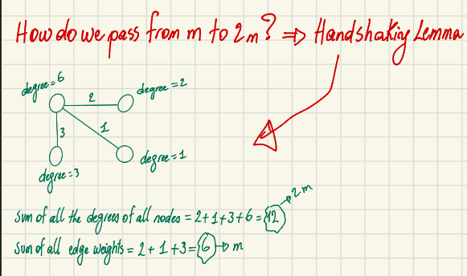
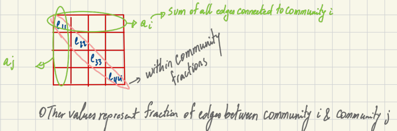

# Understanding Modularity in Networks

After studying the Leiden Algorithm and the Louvain algorithm for community detection in graphs, where both algorithms try to optimize a score function which is the Modularity (or CPM in some cases), I was intrigued to deepen my readings on the Modularity function. Here it is in this blog post.

Modularity tries to maximize the difference between the actual number of edges inside a community and the expected number of such edges. 

## Node-Level Perspective

[Insert screenshot of the graph diagram with node degrees from Page 1 here]

Modularity can be understood from a node-level perspective using the following equation:

$$Q = \frac{1}{2m} \sum_{i,j} \left( A_{ij} - \frac{k_i k_j}{2m} \right) \delta(c_i, c_j)$$

Let's break down the components of this equation:
* **$A_{ij}$ (Reality):** The actual edge weight between node $i$ and node $j$. The aim of the algorithm is to evaluate these edge weights.
* **$k_i$:** The sum of edge weights connected to node $i$. A.K.A The degree of node $i$
* **$\frac{k_i k_j}{2m}$ (Random Null Model):** The expected probability of a link existing between node $i$ and node $j$ if connections were completely random.
* **$m$:** The actual total weights of all the unique edges in the network.
* **$2m$:** The total sum of degrees of all nodes.

### The Kronecker Delta
The Kronecker delta function $\delta(c_i, c_j)$ ensures we only consider nodes within the same community:

$$\delta(c_i, c_j) = \begin{cases} 1 & \text{if } c_i = c_j \\ 0 & \text{if } c_i \neq c_j \end{cases}$$

### Handshaking Lemma
How do we pass from $m$ to $2m$? The **Handshaking Lemma** states that the sum of all degrees of all nodes is twice the sum of all edge weights.
For example, in a simple network:

* Sum of all edge weights = 6 $\rightarrow m$
* Sum of all node degrees = 12 $\rightarrow 2m$

---

## The Modularity Function: Comparing Reality to Expectation

The modularity function essentially compares reality to expectation. 

* **Reality:** $A_{ij}$ is the actual connection weight between nodes $i$ and $j$.
* **Expectation:** $\frac{k_i k_j}{2m}$ is the expected connection if all connections in the network were completely random. It asks: *What is the probability of $i$ and $j$ being connected based solely on their degrees (i.e., their popularity)?*

### Deriving the Expected Probability
Imagine each degree a node has is a "half-edge" waiting to be connected to another node. Therefore, we will have a total of $2m$ half-edges (aka $2m$ degrees) in the network, where $m$ is the total weight for all edges.

The probability of selecting a half-edge that belongs to node $i$ is $P(i)$ where $k_i$ is the nb of connections of node $i$:

$$P(i) = \frac{k_i}{2m}$$

Similarly, for node $j$:

$$P(j) = \frac{k_j}{2m}$$

Assuming independence (i.e., assuming that all edges are placed completely at random), the probability of one specific pair of nodes $i$ and $j$ connecting is the product of their individual probabilities:

$$P(i \cap j) = P(i) \times P(j) = \frac{k_i}{2m} \times \frac{k_j}{2m} = \frac{k_i k_j}{(2m)^2}$$

*Conceptually:* If you close your eyes and pick any connection, $P(i \cap j)$ is the probability that the first end of this connection will be $i$ and the second end will be $j$.

For the whole network, since we have $2m$ total half-edges connecting, the expected number of edges between $i$ and $j$ is:

$$E[A_{ij}] = 2m \times P(i \cap j) = 2m \times \frac{k_i k_j}{(2m)^2} = \frac{k_i k_j}{2m}$$

---

## Community Perspective (Macro View)

Modularity can also be calculated from a community perspective, which is generally faster to compute:

$$Q = \frac{1}{2m} \sum_{c} \left( e_c - \gamma \frac{K_c^2}{2m} \right)$$

Where:
* **$e_c$:** The total weight of all internal edges within community $c$.
* **$\frac{K_c^2}{2m}$:** The expected number of internal edges in community $c$ based on random chance.
* **$\gamma$:** The resolution parameter.

### Passing from Micro View to Macro View
How do we map the node-level variables to community-level variables?
* **Edges:** $A_{ij} \rightarrow e_c \Rightarrow e_c = \sum_{i,j \in c} A_{ij}$
* **Degrees:** $k_i k_j =  K_c^2$
    * $K_c = \sum_{i \in c} k_i$  
    * $K_c^2 = \sum_{i,j \in c} k_i k_j$

**Removing the Kronecker Delta:** The micro view uses $\delta(c_i, c_j)$ to calculate modularity only for nodes inside the same community. Since the macro view inherently uses a sum over communities ($\sum_{c}$), the Kronecker delta is no longer needed.

### The Resolution Parameter ($\gamma$)
The resolution parameter adjusts the size and number of the communities found:
* If **$\gamma = 1$**: The macro equation yields the exact same results as the micro equation.
* If **$\gamma > 1$**: This places a higher penalty on the random model, forcing the algorithm to find *more* communities.
* If **$\gamma < 1$**: This places less penalty, resulting in *fewer* communities.

---

## The Original Modularity Definition

In the original paper introducing Modularity, Finding and evaluating community structure in networks by Newman and Girvan, the authors defined it using fractions of edges:

$$Q = \sum_i (e_{ii} - a_i^2) = \text{Tr}(e) - ||e^2||$$

Where:
* **$e_{ij}$:** The fraction of edges that link nodes in community $i$ to community $j$.
* **$e_{ii}$:** The fraction of edges that connect nodes *within* community $i$. Thus, $\sum_i e_{ii}$ represents the fraction of all within-community edges.
* **$a_i$:** The sum of all edge fractions connected to community $i$.

The values $e_{ij}$ form a $K \times K$ symmetric matrix $e$, where $K$ is the number of communities. The diagonal values (e.g., $e_{11}, e_{33}$) represent the fractions of within-community edges, while the other values represent the fractions of edges between community $i$ and community $j$.

### Matrix Example
Consider a matrix $e$:

$$e = \begin{bmatrix} 0.4 & 0.01 \\ 0.01 & 0.5 \end{bmatrix}$$

Assuming there are 10 total edges in the network:
* **0.4 $\times$ 10 = 4** edges are internal to Community 1.
* **0.5 $\times$ 10 = 5** edges are internal to Community 2.
* **0.01 + 0.01** accounts for the 1 edge connecting both communities.

### Analyzing the Original Equation
* **Random Expectation ($a_i^2$):** If edges were placed completely at random between community $i$ and $j$, the expected fraction is $a_i a_j$ (similar to the multiplication of two independent probabilities).
* By subtracting the random expectation ($a_i^2$) from the actual reality ($e_{ii}$) for every community, the formula calculates whether the internal connections are denser than a random distribution.

### Comparing the Two Equations
The only difference between the original modularity equation and the generalized community equation is the resolution parameter ($\gamma$):

1.  $$Q = \sum_i (e_{ii} - a_i^2)$$
2.  $$Q = \frac{1}{2m} \sum_c \left( e_c - \gamma \frac{K_c^2}{2m} \right)$$

If $\gamma = 1$, the two equations are exactly the same. I will let you do the math!