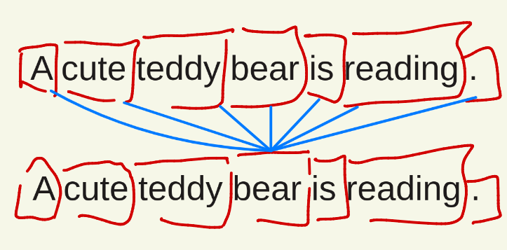
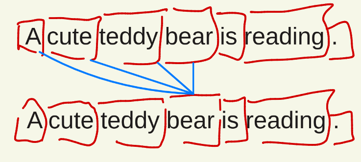
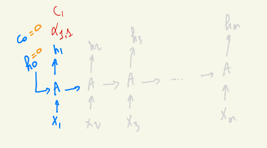
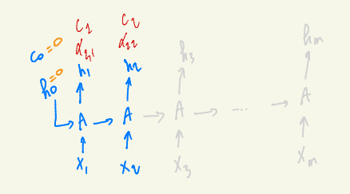
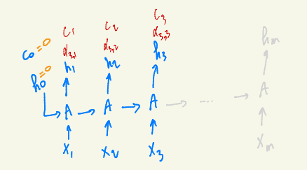

# Self-Attention Models: An Intuitive Introduction

Hi there, in this post, I present my notes on self-attention models, building upon the attention mechanism discussed in my previous article. This content is based on Shusen Wang's explanations of self-attention with RNNs, combined with insights from other resources. For more details on the basic attention mechanism, see my [introduction article to attention models](../attention_models/).

## What is Attention?

Attention models (as previously discussed) when combined with the encoder and decoder RNNs allow tokens from the RNN decoder, at each step, to pay attention to all of the outputs of the encoder RNN. For translation tasks, this is useful when translating a word, to know where to look in the encoder part. Then it calculates similarities and weights, to give a weight for each token from the encoder as a relevance criteria to the current step.

## What is Self-Attention?

**Self-attention is an extension of the attention mechanism.** In other words, the attention mechanism when applied on a single RNN, allows each token to take a look (pay attention) on all other tokens from the same RNN.

In a transformer, self-attention, when used in the encoder for example, allows words to be encoded as a direct function of their context. This is useful for example when encoding the word "apple". Depending on their surrounding words, the word "apple" will be encoded as being the "apple" (fruit) or "apple" (the company).

## Self-Attention vs. Masked Self-Attention

Shusen Wang, in his videos, explains the concept of self-attention by combining RNNs and the attention mechanism. In his videos, he presents it as self-attention, however, what he presents is actually **masked self-attention**. 

The difference between self-attention and masked self-attention is:
- **Self-attention**: compares each token with all the other tokens in the sentence
- **Masked self-attention**: for example in a case of translation, compares a generated word with all the previous words, but not the next words, since they are not yet generated

*Figure: In self-attention, each token (word) attends to all other tokens in the same sentence.*

*Figure: In masked self-attention (as used in decoders), each token attends only to previous (or current) tokens, and not to future tokens.*

**Terminology:** The token we are comparing is called the **query**, the tokens to which we compare are called the **keys**.

## Self-Attention with RNNs: Step-by-Step Example

Here are my notes on Shusen Wang's example of self-attention with RNN, step by step.

### Step 1

*Figure: Visualization of self-attention mechanism as explained in Shusen Wang's video. Each token's representation is updated by attending to all (or previous, if masked) hidden states in the sequence, resulting in context-aware feature vectors.*

In a simple RNN as in our previous article, $h_1$ is a function of $h_0$ and $x_1$. However, in self-attention, it's a function of $x_1$ and the context vector.

$$h_1 = \tanh(A \cdot [x_1, c_0])$$

The context vector is a weighted average of all the previous hidden states. At the beginning, $c_0 = 0$ and $c_1 = h_1$ since there is no previous $h_i$ vectors. 

A weighted average implies weights for each hidden state. Each weight is calculated with the align function (it's like a similarity function, the bigger the similarity is, the bigger the weight). In general, the weights $\alpha$ are calculated as:

$$\alpha_{\text{currentstep},i} = \text{align}(h_i, h_{\text{currentstep}})$$

In our current step, the weight is just an align function between the first hidden state and itself:

$$\alpha_{1,1} = \text{align}(h_1, h_1)$$

### Step 2

*Figure: At step 2, the token computes attention weights with respect to all previous and current tokens' hidden states. Note the weights are different than the weights of the first step.*

Next, $h_2$ is calculated as:

$$h_2 = \tanh(A \cdot [x_2, c_1])$$

So $h_2$ knows both $x_2$ and $x_1$ through the context vector.

To calculate the context vector $c_2$, we need to calculate a weighted average of all the present hidden states. So we should first calculate weights:

$$\alpha_{2,1} = \text{align}(h_1, h_2)$$

$$\alpha_{2,2} = \text{align}(h_2, h_2)$$

Then the context vector for this step is:

$$c_2 = \alpha_{2,1} \cdot h_1 + \alpha_{2,2} \cdot h_2$$

### Step 3

*Figure: At step 3, the token computes attention weights (alphas) with respect to all previous and current tokens' hidden states. This determines how much information from each position is included in the context vector for the current step. The context vector is then used, together with the current input, to update the representation for this token.*

Again, $h_3$ is calculated as:

$$h_3 = \tanh(A \cdot [x_3, c_2])$$

Then we recalculate all the alphas:

$$\alpha_{3,1} = \text{align}(h_3, h_1)$$

$$\alpha_{3,2} = \text{align}(h_3, h_2)$$

$$\alpha_{3,3} = \text{align}(h_3, h_3)$$

The context vector $c_3$ would then be:

$$c_3 = \alpha_{3,1} \cdot h_1 + \alpha_{3,2} \cdot h_2 + \alpha_{3,3} \cdot h_3$$

## General Pattern

From the examples above, we can see the general pattern for self-attention with RNNs:

1. **At each step $t$**, the hidden state $h_t$ is computed as:
   $$h_t = \tanh(A \cdot [x_t, c_{t-1}])$$
   where $c_{t-1}$ is the context vector from the previous step.

2. **Attention weights** are calculated for all previous and current hidden states:
   $$\alpha_{t,i} = \text{align}(h_t, h_i) \quad \text{for } i = 1, 2, \ldots, t$$

3. **The context vector** $c_t$ is computed as a weighted sum:
   $$c_t = \sum_{i=1}^{t} \alpha_{t,i} \cdot h_i$$

This process allows each token to incorporate information from all previous tokens (and itself) in the sequence, creating context-aware representations that are essential for understanding the meaning of words based on their surrounding context.

## Summary

Self-attention extends the attention mechanism to work within a single sequence, allowing each token to attend to all other tokens in the same sequence. This creates rich, context-dependent representations that are crucial for modern NLP models like transformers. The key difference from standard attention is that self-attention operates on a single RNN rather than between encoder and decoder RNNs.

In masked self-attention (used in decoders), tokens can only attend to previous tokens, preventing information leakage from future tokens during generation tasks.

