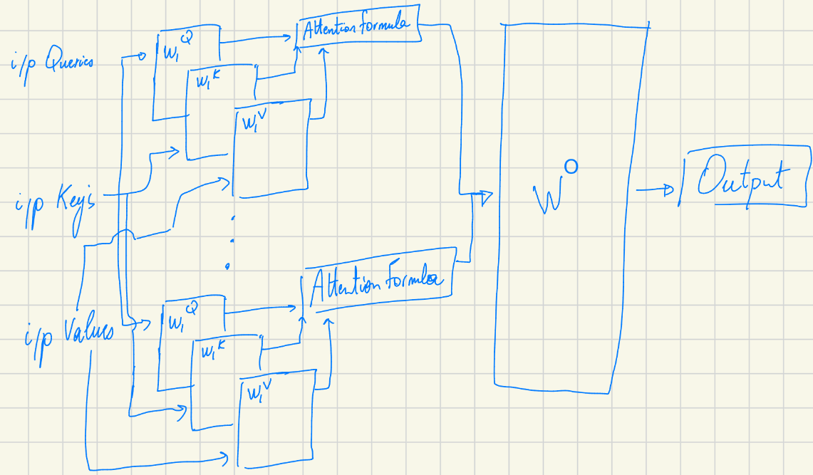
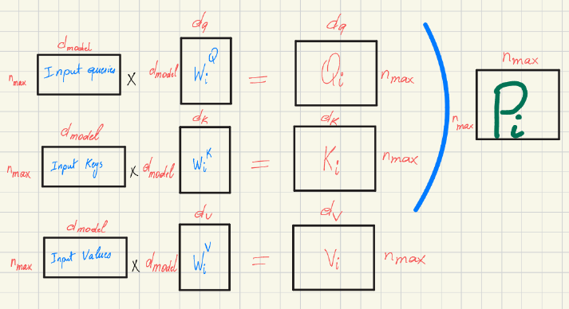
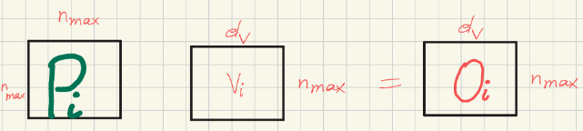
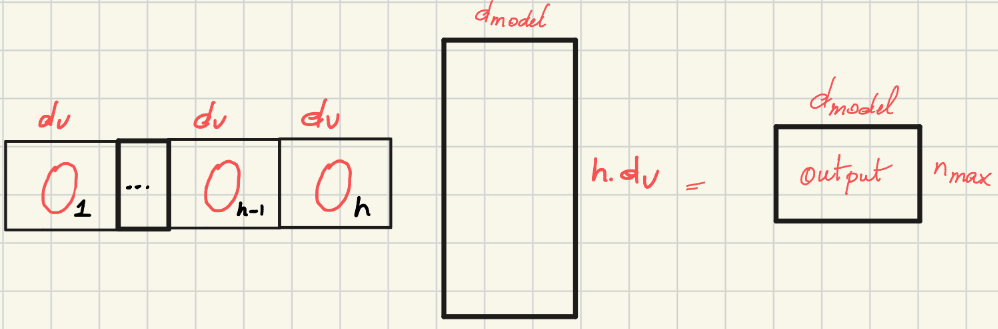

## Transformers series pt1. 
# Deconstructing the Transformer: A Deep Dive into Attention Mechanics

> *Author's Note: This post is adapted from my personal study notes while working through the [**"Super Study Guide"**](https://superstudy.guide/transformers-large-language-models/) book on Transformers.
> 
Since the introduction of the Transformer architecture, the landscape of natural language processing has fundamentally shifted. But what exactly makes these models so powerful? The secret lies in how they process relationships between words. 
As we will see, they are able to generate embeddings that are token aware, position aware and context aware.

Let's dive into the main building block of a transformer model which is the self-attention model.
First I will explain what is the Query, Key and Value to build one self attention block. Then how to put them together to create the multihead attention block. Finally I will give an overview how the transformer architecture is formed.

## The Core of Context: The Self-Attention Mechanism

At its heart, the self-attention mechanism allows each token to pay attention to all other tokens regardless of the distance between them. Unlike earlier sequential models, Transformers create representations where words are encoded as a function of their context - which is useful when the same word can have different meanings depedending on its surrounding words.

To achieve this, the model needs a way for a token to attend to another. We measure similarity between a given query ($q$) and each of the other $n$ keys ($K_i$). The model then weights the associated values ($V_i$) by their similarity.

### But first, what is a query, key and value ? 
A helpful analogy is to imagine a database search:
*   **Query ($Q$):** The word you are using to search a database.
*   **Key ($K$):** The titles of the pages in that database.
*   **Value ($V$):** The actual content you retrieve from the page.
  
Actually $Q$ at the beginning is calculated as the input $X \cdot W_q$ where $W_q$ is a learnable parameter. So we allow the system to infer different representations for $X$ that in our analogy are the query, the title and the content of the page.

## The Mathematics of Attention
The entire process is computed efficiently through matrix multiplication. The standard attention formula is defined as:

$$\text{Attention}(Q, K, V) = \text{Softmax}\left(\frac{QK^T}{\sqrt{d_k}}\right)V$$

Let's break down why this specific mathematical formulation is used:

1.  **Similarity Calculation:** We calculate similarities between the current token $q$ and each of the other tokens $K$. In other terms, this measures how much a query is aligned with a key.
2.  **Applying softmax:** In order for all the similarities calculated to sum to 1, we apply softmax function i.e., $\text{softmax}(q \cdot k_i)$. 
3.  **The Scaling Factor ($\frac{1}{\sqrt{d_k}}$):** As the dimension $d_k$ grows, the dot products can explode into massive numbers. We divide by $\sqrt{d_k}$ because large numbers push the Softmax function into regions with a flat plateau (near 1 or 0). This creates a vanishing gradient problem for gradient descent, effectively stopping the model from learning. So now $\text{softmax}\left(\frac{q \cdot k_i}{\sqrt{d_k}}\right) = p_i$.
4.  The $p_i$ will be considered the weight that we will use to weight the actual information $v_i$.

It is worth noting that the computational complexity of this attention operation is $O(N^2)$.

## Multi-Head Attention (MHA): Committee of Experts

While standard self-attention is powerful, Multi-Head Attention (MHA) pushes the architecture further. MHA contains $h$ attention heads which enable the input embeddings to attend to one another in different ways and in parallel.

But why do we need several heads? Language is complex, and one word can have many different types of relationships simultaneously. Multiple heads allow the model to multi-task:
*   **Head 1** might focus on Grammar.
*   **Head 2** might focus on Vocabulary.
*   **Head 3** might focus on Coreference.

### Learnable Parameters: The Projection Matrices

Within each attention head, we multiply the inputs with projection matrices ($W^Q, W^K, W^V$) to obtain $Q, K,$ and $V$. 

*   $Q = X \cdot W^Q$
*   $K = X \cdot W^K$
*   $V = X \cdot W^V$

These weight matrices are the **learnable parameters** of the model. You might wonder: why not just use the raw input matrix $X$? We use these learnable projections to allow the model to have different points of view for the same word—specifically as a Query, Key, or Value. 

Once the attention operation is done for each head, the model concatenates all outputs ($O_i$). Finally, this concatenated output is multiplied by a final projection matrix ($W^O$) to produce an output.

<!-- ## Bringing It Together: The Transformer Architecture

The complete Transformer architecture is a composed stack of layers of Encoders and Decoders.

*   **Encoders:** These map input tokens to generated results (embeddings) that are aware of surrounding words. The embeddings coming out from the encoder are token-aware, position-aware, and context-aware. Because of this, the embeddings will change if the surrounding tokens change, reflecting a different meaning or context.
*   **Decoders:** These generate output tokens depending on both the encoded tokens and the past predicted output tokens. 

By combining the parallel processing power of Multi-Head Attention with the deep contextual understanding of these learnable projections, Transformers have fundamentally redefined what is possible in machine learning. -->

<!-- 1.  **Similarity Calculation:** We calculate similarities between the current token $q$ and each of the other tokens $K$. 
2.  **The Scaling Factor ($\frac{1}{\sqrt{d_k}}$):** As the dimension $d_k$ grows, the dot products can explode into massive numbers. We divide by $\sqrt{d_k}$ because large numbers push the Softmax function into regions with a flat plateau (near 1 or 0). This creates a vanishing gradient problem for gradient descent, effectively stopping the model from learning.
3.  **Normalization:** We use the Softmax function to rescale the values so that they sum to 1. These act like normalized weights ($P_i$).
4.  **Value Weighting:** Finally, this normalized weight is multiplied by $V_i$. -->

### Let's Talk Dimensions: Inside a Single Attention Head

**A Crucial Distinction on Inputs:**
* **Self-Attention (Encoder):** As we will see later in the Encoder part of the Transformer architecture, the inputs are all derived from the exact same source matrix: 
    **Input Queries = Input Keys = Input Values = $X$**
* **Cross-Attention (Decoder):** In the Decoder part of the Transformer architecture, these inputs **are not the same** (Queries come from the decoder sequence, while Keys and Values come from the encoder sequence).

**Understanding the Variables:**
* $d_{model}$: The dimension of the original word embedding (the input $X$). In the original Transformer paper, $d_{model} = 512$.
* $d_q$ and $d_k$ (Queries and Keys): **Must be equal.** In order for the attention formula's matrix multiplication between $Q$ and $K^T$ to mathematically work, $d_q$ and $d_k$ must be exactly the same size.
* $d_v$ (Values): Can technically be a different dimension, but usually isn't.
* $n_{max}$ (Input size): The maximum length of the input token sequence.

The output of a single attention head ($O_i$) is calculated by multiplying the normalized attention weights ($P_i$) by the projected values ($V_i$). This represents the final output of the attention formula for that specific head (as referenced in the earlier Multi-Head Attention architecture diagram).

**The Final Multi-Head Output:**
The final output of all the attention heads combined is calculated by concatenating all the individual head outputs ($O_i$) together side-by-side, and then multiplying them by a final projection matrix, $W^O$.

