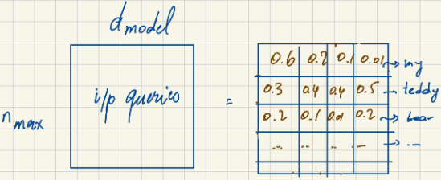
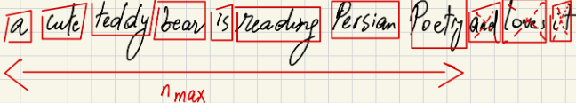
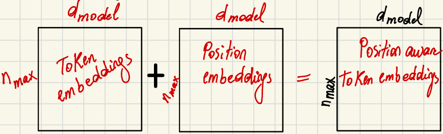
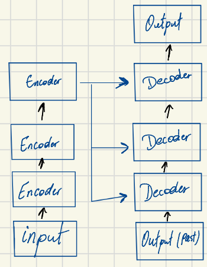
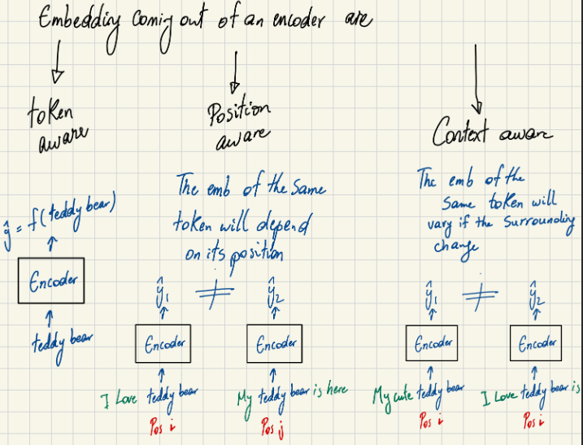
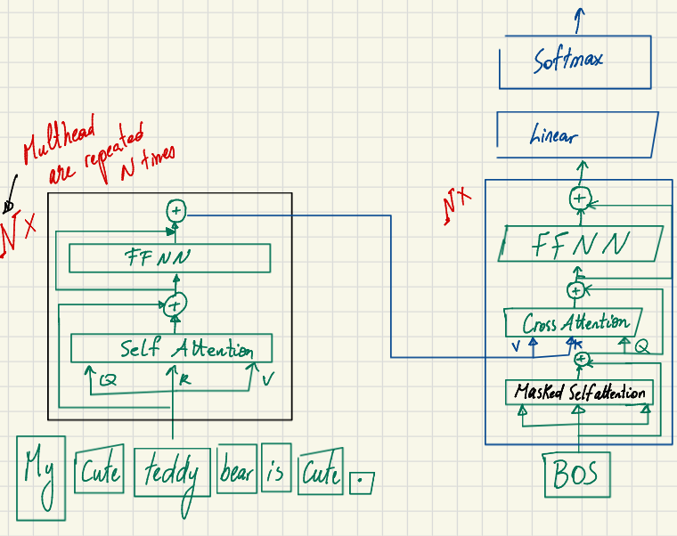
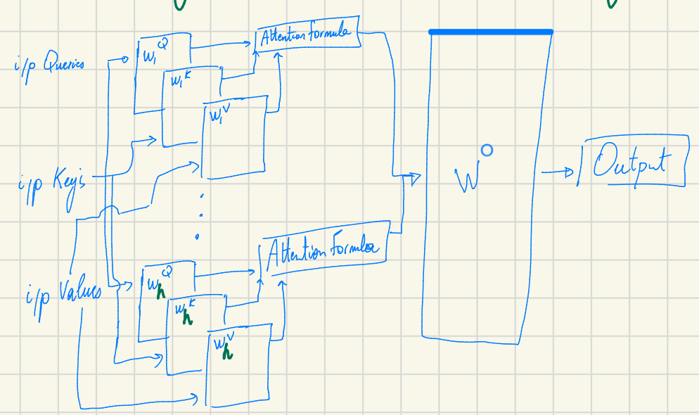
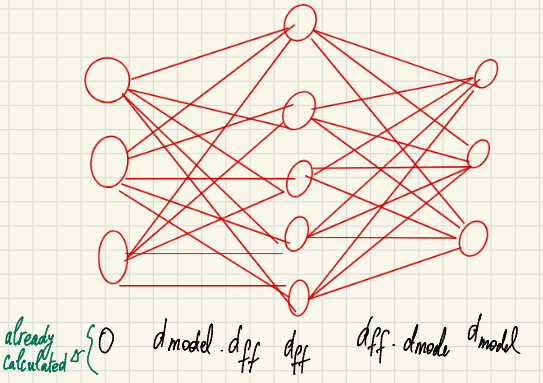
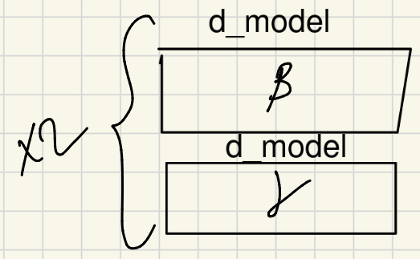

# Understanding the Transformer architecture part2: let's have a walk inside the Encoder

> *Author's Note: Everything in here is from my study notes from the the **"Super Study Guide"** I am just writing it to share my transformers study journey. In Part 1, I covered the core math of Self-Attention and Multi-Head Attention. Now, I am going further into the encoder part of a transformers model.

Before we look at the full Transformer network, we need to clarify the shape of the data flowing through it. Two variables define the entire data structure: $n_{max}$ and $d_{model}$.

## The Shape of Data: $n_{max}$ vs $d_{model}$

When we feed a sentence into a Transformer, we represent it as a matrix. Let's break down its dimensions:

* **$n_{max}$ (Sequence Length):** This is the maximum length of the input token sequence.
* **$d_{model}$ (Embedding Dimension):** This is the dimension of a single token's embedding. In the original Transformer paper, $d_{model} = 512$. 

So, an input sequence is ultimately represented as a matrix of size $n_{max} \times d_{model}$.

## Tokenization and the Padding Trick

To get our raw text into the $n_{max} \times d_{model}$ shape, we must first tokenize it. Tokenization converts the source sentence into tokens using predefined algorithms like WordPiece or BPE (Byte Pair Encoding). A token can be a sub-word, but for simplicity, let's assume it is a full word.

But what happens if our tokenized sentence doesn't perfectly match $n_{max}$?

* **If $n > n_{max}$:** We crop the input to fit the maximum sequence length.

* **If $n < n_{max}$:** We use the **Padding Trick**. We add `[PAD]` tokens to the end of the sequence until it reaches the maximum length. 
    

This padding trick allows all the tokenized sentences to have the exact same length, which is absolutely necessary for doing efficient batch training on GPUs.

## Generating the Input Embeddings

Once we have our sequence of tokens, we need to generate the actual embeddings from the source sentence. The final input embedding is an addition of two components:

1.  **Input Token Embedding:** For each token, we grab its $d_{model}$ dimensional representation from a vocabulary matrix. If our vocabulary size is $|V|$, this matrix has a size of $|V| \times d_{model}$.
2.  **Position Embedding:** Because Self-Attention processes all tokens simultaneously, we must explicitly encode the position of each token. We combine the token embedding with a position embedding of the same dimension. Each position up to $n_{max}$ has an associated position embedding (which is the same across all sequences).

The result is a **position-aware** embedding of size $n_{max} \times d_{model}$.

### Math Check: Embedding Parameters
How many learnable parameters are in this initial embedding step?
* Vocabulary Embeddings: $|V| \cdot d_{model}$
* Positional Embeddings: $n_{max} \cdot d_{model}$
* **Total:** $d_{model}(|V| + n_{max})$

## High-Level Architecture and Inference

Now we can look at the complete picture. The Transformer architecture is composed of a stack of Encoders and a stack of Decoders. 

During inference, such as translating an English sentence to French (*"My teddy bear is cute"* $\rightarrow$ *"Mon ours en peluche est mignon"*), the process works like this:
* The **Encoder** takes *all* the input tokens at once.
* The **Decoder** predicts the output *one token at a time*, using both the Encoder's final representations and the past predicted output tokens.

### The Power of the Encoder
When the input passes through the Encoder block, the resulting embeddings have three powerful properties:
1.  **Token Aware:** Captures the semantic meaning of the individual word/token.
2.  **Position Aware:** The embedding changes depending on where the token appears in the sentence (e.g., "teddy" at the start vs. the end).
3.  **Context Aware:** The embedding for the same token adapts based on surrounding words; e.g., "bear" in *"My cute teddy bear"* vs. *"I saw a grizzly bear"*.

   
  <em>Figure: The encoder output is <strong>token aware</strong>, <strong>position aware</strong>, and <strong>context aware</strong>.</em>

 

   
  <em>Figure: Visual breakdown of the Encoder Block's internal structure.</em>

## Inside the Encoder: Calculating the Parameters

Let's look inside a single Encoder block and calculate exactly how many parameters it holds. An Encoder ($N \times$ repeated) contains Multi-Head Attention (MHA), a Feed Forward Neural Network (FFNN), and Normalization layers.

### 1. Multi-Head Attention (MHA)
As we established in Part 1, we have $h$ attention heads. Each head has 3 projection matrices ($W^Q, W^K, W^V$), each of dimension $d_{model} \times d_k$ (assuming $d_k = d_v = d_q$). Finally, there is one output matrix $W^O$ of size $(h \cdot d_k) \times d_{model}$.
* Parameters: $3 \cdot (d_k \cdot d_{model}) \cdot h + (h \cdot d_k) \cdot d_{model} = 4 \cdot d_k \cdot d_{model} \cdot h$

### 2. Feed Forward Neural Network (FFNN)
After the self-attention mechanism, the data passes through a Feed Forward Neural Network. This network expands the dimension from $d_{model}$ to a larger internal dimension $d_{ff}$, and then brings it back down to $d_{model}$.
* Parameters: $2 \cdot d_{model} \cdot d_{ff}$
* 

### 3. Normalization Layers
There are normalization layers applied at two points: at the end of the attention layer, and at the end of the FFNN. Each normalization layer has 2 parameters per dimension.
* Parameters: $2 \cdot 2 \cdot d_{model} = 4 \cdot d_{model}$
* 

I will explain later $\beta$ and $\gamma$ parameters. 

### Total Parameters per Encoder Layer
Summing it all together, the total number of learnable parameters for a single Encoder layer is:

$$4 \cdot d_k \cdot d_{model} \cdot h + 2 \cdot d_{model} \cdot d_{ff} + 4 \cdot d_{model}$$

If we have $N$ encoder layers so we multiply by $N$, so it will be $$(4 \cdot d_k \cdot d_{model} \cdot h + 2 \cdot d_{model} \cdot d_{ff} + 4 \cdot d_{model}) \times N$$
