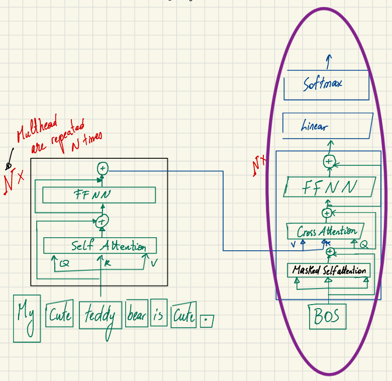
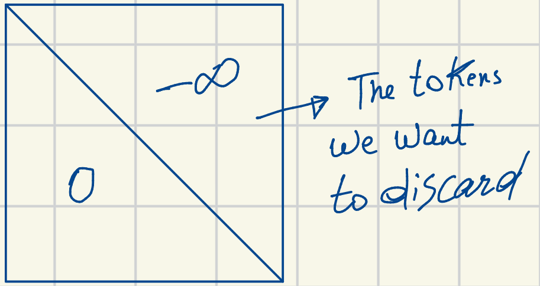
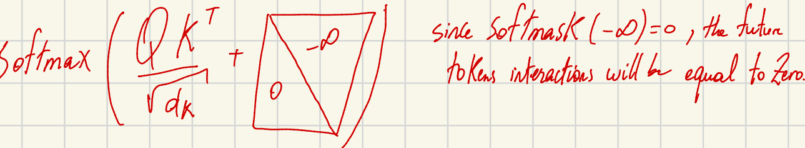
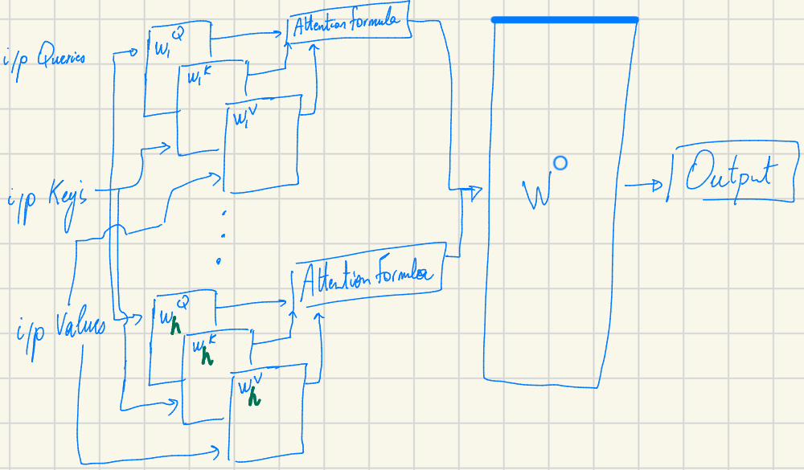
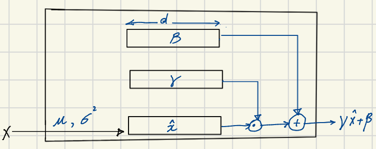

# Transformer architecture Part 3: Inside the Decoder

Welcome again, here I continue sharing my journey learning the transformer architecture. Today I talk about the decoder part of a transformer model. 
These are my personal notes studying the **"Super Study Guide": Transformers and Large Language Models** by Afshine Amidi and Shervine Amidi.

## An Overview of the Decoder
The primary role of the Decoder is to take the encoded input embeddings and combine them with the decoded output embeddings that have been generated so far. It is composed of multiple repeated blocks (typically N times) that process the data sequentially through sub-components like self-attention, cross-attention, and feed-forward neural networks.

Let's break down the individual pieces that make the Decoder tick.

## 1. Masked Self-Attention
The first major sub-layer in the Decoder is Masked Self-Attention. 

Unlike the encoder, the decoder relies on a specific type of attention that allows each output token to interact *only* with previously generated output tokens. It is strictly prevented from "seeing" future tokens. 

Why is this necessary? During the training process, we want the model to learn how to predict the next word relying solely on the words it has already generated. For instance, if the generated sequence so far is "cute teddy bear is reading", the token "bear" should not be able to attend to the future word "reading"; that information must be ignored.

To achieve this computationally, the attention score ($QK^T$) calculation is modified. A mask—which is essentially a matrix containing negative infinity ($-\infty$) entries—is added to the scores at the locations we want the model to discard. Because the softmax function evaluates to zero for negative infinity ($softmax(-\infty) = 0$), the interactions with future tokens are effectively zeroed out. This masking trick forces the model to interact only with already generated words.

The number of parameters in a Masked Self-Attention layer is exactly the same as in a regular self-attention layer: $4 \times d_{model} \times d_k \times h$.

Remember of a previous post, a self attention looks like this:

where $W_i^Q$,$W_i^K$,$W_i^V$, are the weight matrix that transforms the input X to query, key and value. Where $X$ has the dim of $n_max$ x $d_{model}$ and W_i has the dim of $d_{model}$ x $d_k$ assuming $d_k = d_q = d_v$.

## 2. Cross-Attention
Next up is the Cross-Attention layer.

In standard self-attention, the Queries (Q), Keys (K), and Values (V) all originate from the same source. Cross-attention, however, works differently:
* The **Query (Q)** comes from the decoded output generated so far (the past).
* The **Keys (K)** and **Values (V)** come from the encoder side, representing the original input sentence.

This configuration is critical because it enables the decoded output sequence to interact with the source representations. Just like self-attention, the number of parameters for this layer is also $4 \times d_{model} \times d_k \times h$.

## 3. Feed-Forward Neural Network (FFNN)
Following the cross-attention layer, the embeddings pass through a Feed-Forward Neural Network (FFNN). This component functions exactly the same as it does in the encoder. Its primary purpose is to subject the output of the cross-attention layer to a non-linear transformation.

## 4. Normalization Layers
Throughout the Decoder block, you'll find Normalization layers (specifically Layer Normalization). There are three such layers in the decoder, resulting in a parameter count of $3 \times 2 \times d_{model}$.

The objective of these layers is to normalize the activations coming out of the previous sub-layers. Here is how it works mathematically:

1.  **Compute Mean and Variance**: First, the mean ($\mu = \frac{1}{d} \sum x_i$) and the variance ($\sigma^2 = \frac{1}{d} \sum (x_i - \mu)^2$) of the activations are computed.
2.  **Normalize**: The activations are normalized using the formula $x' = \frac{x - \mu}{\sqrt{\sigma^2 + \epsilon}}$. This effectively centers the data points around 0 and forces the spread to a scale of 1.
3.  **Scale and Shift**: Finally, the layer applies scaling and shifting using the formula $LN(x) = \gamma x' + \beta$. 

Why do we need this final scale and shift step? Sometimes the network requires the data to possess a specific mean and variance to perform its task optimally rather than a strict 0 mean and 1 variance. To accommodate this, $\gamma$ (gamma) and $\beta$ (beta) are introduced as two learnable parameters for the network to adjust.
